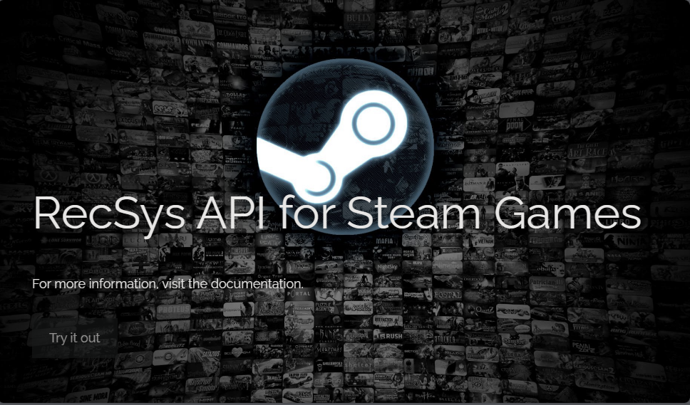

<a name="readme-top"></a>

<!-- PROJECT SHIELDS -->
[![Contributors][contributors-shield]][contributors-url]
[![Forks][forks-shield]][forks-url]
[![Stargazers][stars-shield]][stars-url]
[![Issues][issues-shield]][issues-url]
[![MIT Licencia][Licencia-shield]][Licencia-url]
[![LinkedIn][linkedin-shield]][linkedin-url]


<!-- PROJECT LOGO -->
<br />
<div align="center">
  <a href="https://github.com/FreddyPinto/recsys-steam-games">
    
    
  </a>

<h3 align="center">RecSys API  for Steam Games</h3>

  <p align="center">
    API REST que permite acceder a datos de Steam y obtener recomendaciones de juegos personalizadas basadas en un modelo de aprendizaje automático.
    <br />
    <a href="https://github.com/FreddyPinto/recsys-steam-games"><strong>Explorar docs »</strong></a>
    <br />
    <br />
    <a href="https://github.com/FreddyPinto/recsys-steam-games/issues">Reportar Bug</a>
    ·
    <a href="https://github.com/FreddyPinto/recsys-steam-games/issues">Request Feature</a>
  </p>
</div>


<!-- Tabla de contenido -->
<details>
  <summary>Tabla de contenido</summary>
  <ol>
    <li>
      <a href="#acerca-del-proyecto">Acerca del Proyecto</a>
      <ul>
        <li><a href="#desarrollado-con">Desarrollado con:</a></li>
      </ul>
    </li>
    <li>
      <a href="#getting-started">Getting Started</a>
      <ul>
        <li><a href="#prerrequisitos">Prerrequisitos</a></li>
        <li><a href="#instalación">Instalación</a></li>
      </ul>
    </li>
    <li><a href="#uso">Uso</a></li>
    <li><a href="#roadmap">Roadmap</a></li>
    <li><a href="#contribuciones">Contribuciones</a></li>
    <li><a href="#licencia">Licencia</a></li>
    <li><a href="#contacto">Contacto</a></li>
    <li><a href="#agradecimientos">Agradecimientos</a></li>
  </ol>
</details>


<!-- Acerca del Proyecto -->
## Acerca del Proyecto

<p align="center">
  
</p>

Este proyecto es el resultado de un desafío propuesto en la etapa de Labs del bootcamp de data science de SoyHenry, que consistía en crear una API REST utilizando Python y FastAPI. El proyecto abarca todo el ciclo de vida de un proyecto de Machine Learning, desde la recolección y el tratamiento de los datos hasta el entrenamiento y el despliegue en produccción del modelo de ML.

El resultado es un [API REST](https://recsys-steam-api.onrender.com/) que permite acceder a datos de Steam y obtener recomendaciones de juegos personalizadas basadas en un modelo de aprendizaje automático. Mediante la API, se puede consultar información sobre géneros de juegos, usuarios, desarrolladores y reseñas, así como obtener sugerencias de juegos similares o adecuados para los usuarios.

El proyecto se basa en el uso de MLOps, una metodología que combina las prácticas de DevOps con las de Machine Learning, para facilitar el desarrollo, la implementación y el monitoreo de los modelos de ML en entornos productivos.

El proyecto se dividió en las siguientes etapas:

- **Transformaciones:** Se realizó un [preprocesamiento]( https://github.com/FreddyPinto/recsys-steam-games/tree/main/notebooks) de los datos para obtener el formato adecuado para el análisis y el modelado. Se eliminanron las columnas innecesarias que no se necesitaban para las consultas o preparar los modelos de aprendizaje automático, y de esa manera optimizar el rendimiento de la API y el entrenamiento del modelo.

- **Feature Engineering:** Se aplicó [ingeniería de características](https://github.com/FreddyPinto/recsys-steam-games/blob/main/notebooks/3-feature-engineering.ipynb) para extraer información relevante de los datos y crear nuevas variables que ayudaran a mejorar el rendimiento del modelo de ML. Se creó una nueva columna de análisis de sentimiento con NLP para las reseñas de los usuarios. Se utilizó la técnica de one-hot encoding para codificar las variables categóricas y se aplica una normalización a las variables numéricas.

- **Desarrollo API:** Se creo una [API REST](https://github.com/FreddyPinto/recsys-steam-games/blob/main/app) con el framework FastAPI para disponibilizar los datos de la empresa y permitir realizar consultas sobre los mismos. La API cuenta con varios endpoints que devuelven información sobre los géneros, los desarrolladores, los juegos y las recomendaciones de los usuarios.

- **Modelado:** Se utilizó la librería Scikit-learn para entrenar y evaluar los modelos de [ML](https://github.com/FreddyPinto/recsys-steam-games/blob/main/notebooks/3-feature-engineering.ipynb) para el sistema de recomendación. Se desarrollaron dos tipos de modelos de recomendacion basados en filtro colaborativo de tipo item-item y user-item empleando la similitud del coseno.

- **Despliegue:** Se utilizó el cloud application hosting service de Render para el [deploy](https://recsys-steam-api.onrender.com/) de la API en un servidor en la nube y hacerla accesible a través de una URL pública.


<p align="right">(<a href="#readme-top">volver arriba</a>)</p>


### Desarrollado con:

* [![Python][Python]][Python-url]
* [![Scikitlearn][Scikitlearn]][Scikitlearn-url]
* [![FastAPI][FastAPI]][FastAPI-url]
* [![Render][Render]][Render-url]

<p align="right">(<a href="#readme-top">volver arriba</a>)</p>


<!-- GETTING STARTED -->
## Getting Started

Para ejecutar este proyecto localmente sigue estos pasos para configurarlo:

### Instalación

1. Clona el repositorio:
   ```sh
   git clone https://github.com/FreddyPinto/recsys-steam-games.git
   ```
2. Crea un entorno virtual de Python:
    ```sh
    python -m venv venv
    ```
3. Activa el entorno virtual: 
    - En Windows:
      ```sh
      .\env\Scripts\activate
      ```
    - Unix o MacOS:
      ```sh
      env/bin/activate
      ```
4. Instala las dependencias:
   ```sh
   pip install -r requirements.txt
   ```
5. Cambia al directorio :
    ```sh
    cd app
    ```
6. Ejecuta la aplicación:
    ```sh
    uvicorn main:app --reload
    ```
<p align="right">(<a href="#readme-top">volver arriba</a>)</p>


<!-- USAGE EXAMPLES -->
## Uso

Para acceder a la documentación de la API, ingresa a la siguiente URL en tu navegador:
```
http://localhost:8000/docs
```

Allí podrás ver los diferentes endpoints que ofrece la API, así como los parámetros y los ejemplos de respuesta. También podrás probar la API directamente desde el navegador, haciendo clic en el botón **Try it out** y luego en el botón **Execute**.

<p align="center">
  
</p>

Los endpoints disponibles son los siguientes:

+ def **PlayTimeGenre( *`genre` : str* )**:
    Retorna el `año` con mas horas jugadas para dicho género.

+ def **UserForGenre( *`genre` : str* )**:
    Retorna el usuario que acumula más horas jugadas para el género dado y una lista de la acumulación de horas jugadas por año.

+ def **UsersRecommend( *`year` : int* )**:
   Retorna el top 3 de juegos MÁS recomendados por usuarios para el año dado.

+ def **UsersWorstDeveloper( *`year` : int* )**:
   Retorna el top 3 de desarrolladoras con juegos MENOS recomendados por usuarios para el año dado.

+ def **sentiment_analysis( *`developer` : str* )**:
    Según la empresa desarrolladora, se devuelve un diccionario con el nombre de la desarrolladora como llave y una lista con la cantidad total de registros de reseñas de usuarios que se encuentren categorizados con un análisis de sentimiento como valor. 

+ def **recomendacion_juego( *`item_name`: str* )**:
    Ingresando nombre de un juego, retorna una lista con 5 juegos recomendados similares al ingresado.

+ def **recomendacion_usuario( *`user_id`: str* )**:
    Ingresando el id de un usuario, retorna una lista con 5 juegos recomendados para dicho usuario.


<p align="right">(<a href="#readme-top">volver arriba</a>)</p>


<!-- ROADMAP -->
## Roadmap

Este proyecto se realizó como un Producto Mínimo Viable, por lo que se podrían mejorar algunos aspectos en el futuro, con la finalidad de lograr un producto más completo y robusto. Algunas de las posibles mejoras son:

- [ ] Mejorar el análisis de sentimiento de las reseñas, probando con distintos umbrales de clasificación.

- [ ] Usar una base de datos NoSQL como MongoDB para almacenar los datos de los juegos y los usuarios.

- [ ] Mejorar el análisis exploratorio de datos.

- [ ] Dockerizar el proyecto para facilitar el despliegue y la portabilidad de la aplicación.

- [ ] Explorar otras técnicas o librerías para mejorar el análisis de sentimiento y los modelos de recomendación.

- [ ] Considerar el despliegue de la API en servicios gratuitos que no menostengan limitaciones en su capacidad de almacenamiento.

- [ ] Mejorar el mantenimiento del modelo de ML, estableciendo un pipeline que permita reentrenar el modelo según llegan nuevos datos y evaluar su rendimiento de forma continua.

Consulta los [issues abiertos](https://github.com/FreddyPinto/recsys-steam-games/issues) para proponer características (y problemas conocidos).


<p align="right">(<a href="#readme-top">volver arriba</a>)</p>


<!-- CONTRIBUTING -->
## Contribuciones

Las contribuciones son lo que hacen que la comunidad de código abierto sea un lugar increíble para aprender, inspirarse y crear. Cualquier contribución que hagas será **muy apreciada**.

Si tienes una sugerencia para mejorar este proyecto, haz un fork del repositorio y crea un pull request. También puedes simplemente abrir un issue con la etiqueta *“enhancement”*. ¡No olvides darle una estrella al proyecto! Gracias de nuevo.

1. Haz un fork del Proyecto
2. Crea tu feature Branch (`git checkout -b feature/AmazingFeature`)
3. Haz commit de tus cambios (`git commit -m 'Add some AmazingFeature'`)
4. Push a la Branch (`git push origin feature/AmazingFeature`)
5. Abre un Pull Request

<p align="right">(<a href="#readme-top">volver arriba</a>)</p>


<!-- Licencia -->
## Licencia

Distribuido bajo la licencia MIT. Consulta el archivo [LICENSE](LICENSE) para más información.
<p align="right">(<a href="#readme-top">volver arriba</a>)</p>


<!-- Contacto -->
## Contacto

Freddy Pinto - freddypinto@outlook.com 

[![LinkedIn][linkedin-shield]][linkedin-url]

Project Link: [https://github.com/FreddyPinto/recsys-steam-games](https://github.com/FreddyPinto/recsys-steam-games)

<p align="right">(<a href="#readme-top">volver arriba</a>)</p>


<!-- ACKNOWLEDGMENTS -->
## Agradecimientos
Quiero agradecer a las siguientes personas y recursos que me han ayudado a realizar este proyecto:

* A [SoyHenry](https://www.soyhenry.com/) por ofrecerme esta gran oportunidad de participar en el bootcamp de data science y aprender sobre MLOps.
* A la comunidad de Henry, especialmente a los profesores y compañeros que me han apoyado y guiado durante el proceso de aprendizaje.

<p align="right">(<a href="#readme-top">volver arriba</a>)</p>


<!-- MARKDOWN LINKS & IMAGES -->
<!-- https://www.markdownguide.org/basic-syntax/#reference-style-links -->
[contributors-shield]: https://img.shields.io/github/contributors/FreddyPinto/recsys-steam-games.svg?style=for-the-badge
[contributors-url]: https://github.com/FreddyPinto/recsys-steam-games/graphs/contributors
[forks-shield]: https://img.shields.io/github/forks/FreddyPinto/recsys-steam-games.svg?style=for-the-badge
[forks-url]: https://github.com/FreddyPinto/recsys-steam-games/network/members
[stars-shield]: https://img.shields.io/github/stars/FreddyPinto/recsys-steam-games.svg?style=for-the-badge
[stars-url]: https://github.com/FreddyPinto/recsys-steam-games/stargazers
[issues-shield]: https://img.shields.io/github/issues/FreddyPinto/recsys-steam-games.svg?style=for-the-badge
[issues-url]: https://github.com/FreddyPinto/recsys-steam-games/issues
[Licencia-shield]: https://img.shields.io/github/license/FreddyPinto/recsys-steam-games.svg?style=for-the-badge
[Licencia-url]: https://github.com/FreddyPinto/recsys-steam-games/blob/main/LICENSE
[linkedin-shield]: https://img.shields.io/badge/-LinkedIn-black.svg?style=for-the-badge&logo=linkedin&colorB=555
[linkedin-url]: https://www.linkedin.com/in/FreddyPinto-/
[product-screenshot]: images/screenshot.jpg
[Python]: https://img.shields.io/badge/Python-333333?style=flat&logo=python&labelColor=white
[Python-url]: https://www.python.org/
[FastAPI]: https://img.shields.io/badge/-FastAPI-333333?style=flat&logo=fastapi&labelColor=white
[FastAPI-url]: https://fastapi.tiangolo.com/
[Render]: https://img.shields.io/badge/-Render-333333?style=flat&logo=render&labelColor=white
[Render-url]: https://render.com/
[Scikitlearn]:https://img.shields.io/badge/-Scikitlearn-333333?style=flat&logo=scikitlearn&labelColor=white
[Scikitlearn-url]:https://scikit-learn.org/stable/index.html